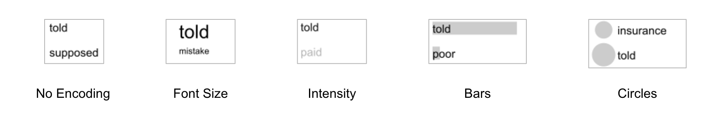
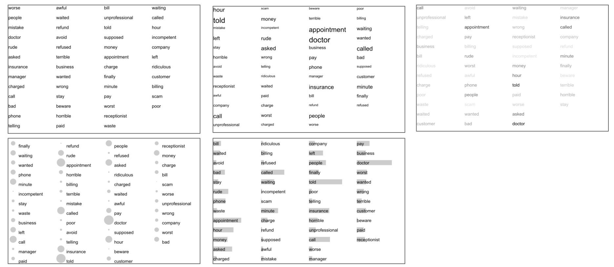
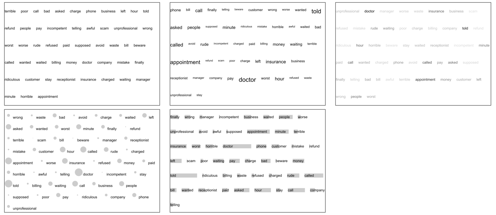

# User Study on Keywords Summaries (a.k.a. Word Clouds)

**Goal**: Test effectiveness of alternate visual representations for keyword summaries.

**Keyword Summaries**: A set of words or phrases extracted from text collections often with the goal of representing the overall content of the text. Usually associated to a importance metric like frequency.

```[Word + Value]```

## Design space
The design space is divided in 2 basic elements:

* **Layout**: How the words are arranged on the screen
* **Mark**: How each word and its value is represented visually
	* *Word as value mark*: In this case the value of each word is mapped to features of the word itself like color and size.
	* *Additional mark for value*:  In this case the value of each mark is mapped to features of an additional mark associated with each word. E.g circle area, bar length

## Layouts


## Marks



# Gallery

## Column



## Row


## Spatial
